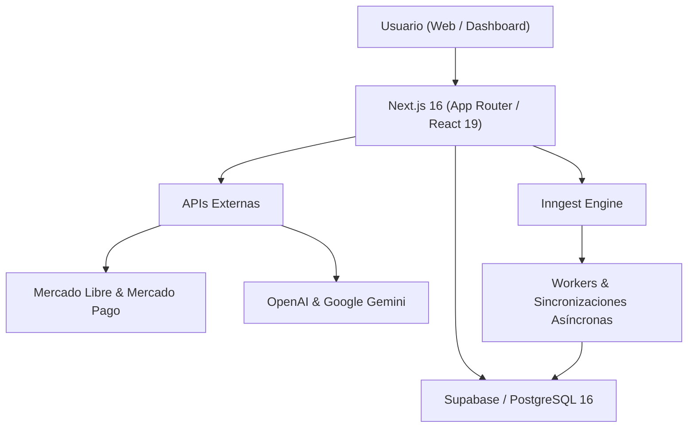

# Klyvo — Plataforma SaaS de gestión y rentabilidad para vendedores de Mercado Libre

Klyvo es una plataforma SaaS multi-tenant diseñada para centralizar la operativa comercial, el control de inventario y el cálculo de rentabilidad neta en tiempo real para vendedores del ecosistema de Mercado Libre. Combina sincronización asíncrona resiliente, auditoría contable por publicación y herramientas de inteligencia artificial bajo estrictos controles de cuota y seguridad transaccional.

**Estado actual:** `Release Candidate — listo para piloto privado multi-cuenta`

---

## 1. Problema que resuelve

Operar como vendedor profesional en Mercado Libre implica gestionar múltiples variables dispersas:
- **Incertidumbre en el margen neto:** Dificultad para conocer la ganancia real por producto tras descontar comisiones por categoría, costos de envío dinámicos, retenciones impositivas, costos financieros de cuotas y descuentos de campañas.
- **Información fragmentada:** Los datos de órdenes, métricas publicitarias (Product Ads), promociones activas y stock físico en depósito se administran en paneles desacoplados.
- **Procesos manuales y falta de trazabilidad:** Modificaciones de precios o stock realizadas directamente sin registro de auditoría ni validación previa de márgenes.
- **Riesgo en multi-cuenta:** Operar varios comercios sin un aislamiento estricto de datos expone a fugas de información y colisiones en sincronizaciones concurrentes.

Klyvo nació para resolver estas fricciones operativas unificando la administración en una sola plataforma con respaldo transaccional.

---

## 2. Funcionalidades implementadas

### Dashboard y analítica
- **KPIs del negocio:** Facturación, ticket promedio, margen neto acumulado y órdenes procesadas en ventanas configurables (7, 30, 90 días o rangos personalizados).
- **Control de costos faltantes:** Detección inmediata de publicaciones sin costo unitario asignado para evitar ventas a ciegas.
- **Alertas de stock crítico:** Monitoreo preventivo de publicaciones próximas a agotar existencias.
- **Estado de sincronización:** Observabilidad del estado de conexión de las cuentas vinculadas y última fecha de actualización.

### Productos y catálogo
- **Sincronización bidireccional:** Ingesta de publicaciones con SKU, categoría, precio de lista, stock y estado desde Mercado Libre.
- **Estructura de costos y componentes:** Vinculación N-a-M de insumos/componentes por producto para composición de costos unitarios.
- **Importación masiva:** Carga y actualización de costos base mediante planillas Excel (`.xlsx`).
- **Historial y métricas por ítem:** Seguimiento de rotación, unidades vendidas y margen por publicación.

### Ventas y órdenes
- **Sincronización idempotente:** Ingesta automática mediante webhooks y reconciliación periódica con detección de duplicados.
- **Rentabilidad unitaria:** Cálculo detallado por orden (ingreso bruto, comisión ML, costo de envío, descuento comercial, costo de mercadería y ganancia neta).
- **Exportación contable en streaming:** Descarga de reportes en formato CSV estándar (`klyvo_ventas_YYYY-MM-DD.csv`) optimizado para grandes volúmenes.
- **Gestión de cancelaciones:** Reversión controlada de stock y ajuste contable ante órdenes canceladas o devueltas.

### Stock interno y depósitos
- **Inventario físico centralizado:** Control de existencias en bodega propia independiente del stock publicado.
- **Deducción automática:** Consumo de stock y componentes disparado por eventos de venta confirmados.
- **Registro de movimientos:** Trazabilidad de ingresos, egresos y ajustes manuales con motivo de movimiento.
- **Órdenes de compra:** Registro de adquisiciones a proveedores para reposición de stock.

### Envíos (Shipments)
- **Sincronización logística:** Seguimiento de estados de envío (listo para despachar, en camino, entregado).
- **Cálculo de impacto en margen:** Incorporación del costo de envío absorbido por el vendedor en la rentabilidad de cada orden.

### Rentabilidad y finanzas
- **Desglose financiero:** Balance consolidado de ingresos, costos de mercadería vendida (CMV), cargos por servicio de Mercado Libre e impuestos.
- **Reportes contables:** Exportación y visualización de flujo de caja operativo.

### Mercado Libre Ads (Publicidad)
- **Métricas de campañas:** Sincronización de inversión publicitaria, clics, costo por clic (CPC) y ventas atribuidas.
- **Rentabilidad publicitaria:** Cruce de ingresos publicitarios con costos de producto para calcular el ROAS y beneficio neto real por campaña.

### Promociones y cupones
- **Monitoreo de ofertas activas:** Integración con la Seller Promotions API para listar promociones tradicionales, relámpago y personalizadas.
- **Desglose de subsidios:** Visualización del porcentaje de descuento aportado por el vendedor versus el financiado por Mercado Libre.

### Inteligencia artificial y asistente de negocio
- **Chat operacional:** Asistente conversacional con acceso a herramientas seguras de base de datos para responder consultas sobre ventas, stock y márgenes.
- **Consultas sobre productos:** Análisis contextualizado de publicaciones específicas y detección de oportunidades de mejora.
- **Sugerencias de títulos:** Generación de alternativas de títulos optimizadas para búsqueda en Mercado Libre.
- **Análisis de competidores:** Evaluación de publicaciones competidoras (precio, tipo de publicación, logística y reputación).
- **Acciones con confirmación explícita:** Operaciones críticas requieren validación en dos pasos mediante la palabra `"confirmo"`.
- **Cuotas atómicas e idempotencia:** Deducción atómica previa vía `consume_tenant_quota` con llaves vinculadas al hash normalizado del payload para evitar sobreconsumo y duplicación de costos.

> **Nota:** Klyvo no responde automáticamente preguntas de compradores en publicaciones de Mercado Libre. Los webhooks del tópico `questions` se registran únicamente con fines de auditoría e ignorados por diseño.

### Suscripciones y facturación
- **Planes comerciales:** Esquemas Starter, Pro y Ultra con límites de uso diferenciados.
- **Integración con Mercado Pago:** Cobro recurrente vía suscripciones (`subscription_preapproval`).
- **Control de cuotas:** Asignación y débito de límites mensuales (créditos de IA, mensajes y ejecuciones).
- **Períodos de gracia:** Mantenimiento de acceso hasta la fecha de expiración tras cancelaciones de plan.

---

## 3. Arquitectura técnica

Klyvo está construido como un monolito modular serverless sobre Next.js y PostgreSQL, desacoplando tareas pesadas a través de colas de eventos en segundo plano.



### Seguridad y aislamiento multi-tenant
- **Row Level Security (RLS) integral:** 44 tablas protegidas mediante políticas RLS estrictas vinculadas al `tenant_id` de la sesión activa.
- **Verificación de contexto en capa de aplicación:** Todas las rutas y acciones invocan `requireTenantContext` y `assertRequestedTenant`, impidiendo accesos cruzados incluso ante parámetros manipulados.
- **Autenticación y roles:** Control de acceso granular (`owner`, `admin`, `user`) con evaluación de feature flags (`strict_tenant_authorization`).
- **Firmas criptográficas en webhooks:** Validación con comparación de tiempo constante (`timingSafeEqual`) de cabeceras `X-Hub-Signature-256` (WhatsApp) y firmas V2 (Mercado Pago).
- **Sanitización de observabilidad:** Enmascaramiento automático de credenciales, tokens OAuth y datos confidenciales en registros de logs y Sentry.

### Resiliencia y escalabilidad
- **Leases distribuidos:** Prevención de colisiones concurrentes mediante `acquire_operation_lease` y `release_operation_lease` con expiración automática.
- **Rate limiting en base de datos:** Limitación de tasa basada en ventanas deslizantes por tenant y endpoint (`check_rate_limit`).
- **Clasificación de errores externos:** Clasificador unificado que distingue fallos no reintentables (400, 403, 402, `invalid_grant` -> fail-fast), refresco controlado ante 401 de Mercado Libre (exactamente 1 reintento con nuevo token), y reintentos con backoff exponencial y respeto a `Retry-After` (hasta 3 intentos) para errores 408, 429 y 5xx.
- **Registro canónico de workers:** Inngest auditado con 12 funciones registradas y validadas estáticamente, evitando ejecuciones huérfanas o no autorizadas.

---

## 4. Stack tecnológico

| Capa | Tecnologías |
|---|---|
| **Frontend** | Next.js 16.2.6 (App Router, Turbopack), React 19.2.6, Tailwind CSS 4.3.0, Radix UI, TanStack Table, Recharts, Lucide Icons |
| **Backend & Runtime** | Node.js `>=22.20.0`, Next.js Route Handlers, Server Actions, TypeScript 6.0.3, Sentry 10.53.1 |
| **Base de Datos** | Supabase (PostgreSQL 16), Row Level Security (RLS), PL/pgSQL RPCs, `postgres.js` |
| **Procesamiento en Segundo Plano** | Inngest 4.4.0 (Event-Driven Workers, Cron Schedules, Step Functions) |
| **Modelos de IA** | OpenAI API (`gpt-4o-mini`), Google Generative AI (`gemini-1.5-flash`) |
| **Integraciones Externas** | Mercado Libre API (OAuth2, Webhooks, Items, Orders, Shipments, Promos, Ads), Mercado Pago SDK, WhatsApp Cloud API |
| **Testing & CI/CD** | Node.js Native Test Runner (TAP), Playwright 1.62.1 (E2E), GitHub Actions |

---

## 5. Pruebas y validación de calidad

El proyecto cuenta con un pipeline de validación automatizado que se ejecuta de forma reproducible en entornos locales y en CI mediante bases de datos PostgreSQL descartables:

- **160 tests unitarios:** Pruebas de lógica de negocio, validación de esquemas, firmas criptográficas, clasificadores de errores e idempotencia.
- **8 suites de auditoría estática:** Verificación de autenticación de rutas, cobertura RLS en 44 tablas, endpoints de webhooks, integridad de facturación, rendimiento de índices, configuración de release, funciones de Inngest y cuotas de IA.
- **Tests de integración multi-tenant:** Validación sobre PostgreSQL real de aislamiento de tenants, idempotencia de webhooks, concurrencia en cuotas, leases distribuidos, cantidad exacta de reintentos por error e inyección de fallas.
- **Tests E2E (Playwright):** 11 flujos críticos de usuario (autenticación, aislamiento RLS, navegación de catálogo, exportación de ventas, permisos y límites de plan).
- **Soak testing sintético:** Suite de prueba de carga sostenida (perfil de 30 minutos) con 5 tenants concurrentes, evaluando throughput, consumo plano de memoria RSS (con histogramas acotados y muestreo reservoir), y ausencia de fugas cross-tenant o leases zombis.

---

## 6. Configuración y ejecución local

### Requisitos previos
- Node.js `22.20.0` (o compatible con `.nvmrc`)
- npm `10.x`
- Proyecto en Supabase o instancia de PostgreSQL local

### Instalación

```bash
# Clonar el repositorio
git clone https://github.com/yoelzoff-glitch/Stockly.git
cd Stockly

# Instalar dependencias
npm install

# Configurar variables de entorno
cp .env.example .env.local
```

### Comandos principales

```bash
# Iniciar servidor de desarrollo
npm run dev

# Ejecutar verificación de tipos y tests unitarios
npm run typecheck
npm test

# Ejecutar el release gate completo con base de datos descartable
npm run verify:sprint8:disposable

# Ejecutar perfil CI de soak test
npm run test:pilot-soak:ci

# Compilar para producción
npm run build
```

---

## 7. Licencia y estado del proyecto

Proyecto desarrollado bajo licencia privada como plataforma SaaS. Actualmente en fase de **Release Candidate** con release gates automatizados y preparación integral para incorporación de cuentas piloto.
