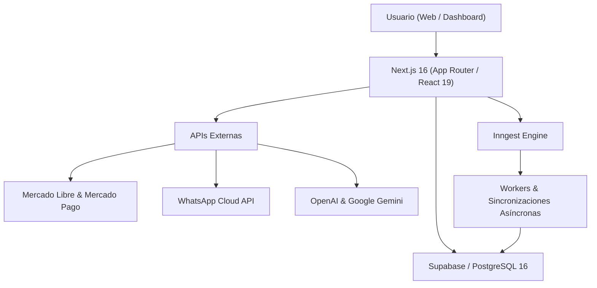

# LibretaX — Plataforma SaaS de Gestión, Inventario y Rentabilidad para Vendedores de Mercado Libre

LibretaX es una plataforma SaaS multi-tenant de alto rendimiento diseñada para centralizar la operativa comercial, el control exhaustivo de inventario físico y el cálculo de rentabilidad neta en tiempo real ("Bolsillo Limpio") para vendedores profesionales del ecosistema de Mercado Libre.

Combina sincronización asíncrona resiliente mediante webhooks, auditoría contable por publicación, control de depósitos físicos con desglose de insumos, y herramientas de inteligencia artificial aplicada bajo estrictos controles transaccionales, de cuota y seguridad multi-tenant.

**Estado actual:** `Release Candidate — Listo para producción y piloto privado multi-cuenta`

---

## Índice General

1. [Problema que resuelve](#1-problema-que-resuelve)
2. [Recorrido Funcional Completo](#2-recorrido-funcional-completo)
   - [2.1 Módulo Operación](#21-módulo-operación)
     - [Dashboard Principal](#dashboard-principal)
     - [Ventas y Órdenes](#ventas-y-órdenes)
     - [Envíos y Logística](#envíos-y-logística)
     - [Cancelaciones y Devoluciones](#cancelaciones-y-devoluciones)
   - [2.2 Módulo Catálogo & Stock](#22-módulo-catálogo--stock)
     - [Productos y Publicaciones](#productos-y-publicaciones)
     - [Stock Interno y Depósito Físico](#stock-interno-y-depósito-físico)
     - [Compras Internas y Proveedores](#compras-internas-y-proveedores)
   - [2.3 Módulo Rentabilidad & Marketing](#23-módulo-rentabilidad--marketing)
     - [Analíticas e Insights Comerciales](#analíticas-e-insights-comerciales)
     - [Finanzas y Estado de Resultados (P&L)](#finanzas-y-estado-de-resultados-pl)
     - [Contabilidad y Estructura de Gastos](#contabilidad-y-estructura-de-gastos)
     - [Promociones y Cupones](#promociones-y-cupones)
     - [Mercado Libre ADS (Publicidad)](#mercado-libre-ads-publicidad)
   - [2.4 Módulo Sistema & Automatizaciones](#24-módulo-sistema--automatizaciones)
     - [Copiloto Operacional IA & Mensajes](#copiloto-operacional-ia--mensajes)
     - [Workflows y Reglas de Automatización](#workflows-y-reglas-de-automatización)
     - [Integraciones Multi-Plataforma](#integraciones-multi-plataforma)
     - [Configuración del Comercio](#configuración-del-comercio)
     - [Facturación y Planes SaaS](#facturación-y-planes-saas)
     - [Panel SuperAdmin](#panel-superadmin)
3. [Arquitectura Técnica y Seguridad Multi-Tenant](#3-arquitectura-técnica-y-seguridad-multi-tenant)
4. [Stack Tecnológico](#4-stack-tecnológico)
5. [Calidad, Testing y Resiliencia](#5-calidad-testing-y-resiliencia)
6. [Instalación y Configuración Local](#6-instalación-y-configuración-local)
7. [Licencia y Estado](#7-licencia-y-estado)

---

## 1. Problema que resuelve

Vender a escala en Mercado Libre presenta desafíos críticos que afectan directamente la rentabilidad:

- **Falta de visibilidad sobre el margen neto real:** Dificultad para conocer la ganancia de bolsillo tras deducir comisiones variables por categoría y tipo de publicación (Clásica vs Premium), costos dinámicos de envío bonificado, cargos por financiamiento en cuotas, retenciones impositivas y costo de mercadería vendida (CMV).
- **Desconexión entre stock publicado y stock físico:** Falta de sincronización entre las existencias publicadas en Mercado Libre y el inventario real en depósito propio, especialmente al trabajar con insumos, embalajes o kits/combos.
- **Herramientas fragmentadas:** La analítica publicitaria (Product Ads), las promociones co-financiadas, las órdenes de compra y los costos fijos de estructura suelen gestionarse en planillas de cálculo separadas y propensas a errores humanos.
- **Riesgo en multi-cuenta:** La necesidad de administrar múltiples cuentas de Mercado Libre sin colisiones operativas, mezclas de inventario ni fugas de información.

LibretaX unifica toda esta operativa en una única consola gerencial automatizada con respaldo transaccional.

---

## 2. Recorrido Funcional Completo

### 2.1 Módulo Operación

#### Dashboard Principal
El centro neurálgico de la plataforma. Proporciona una vista en tiempo real de la salud del negocio:
- **KPIs Principales:** Facturación bruta, ganancia operativa de Mercado Libre, margen neto consolidado, ticket promedio y cantidad de órdenes despachadas.
- **Ventanas Temporales Configurables:** Filtros rápidos por Hoy, Últimos 7 días, 30 días, 90 días, mes en curso o selector de rango personalizado.
- **Gráficos Interactivos de Evolución:** Tendencia diaria de facturación versus ganancia real para detectar fluctuaciones en la rentabilidad.
- **Control de Costos Faltantes:** Detección instantánea de publicaciones con ventas activas que no tienen un costo de mercadería asignado, evitando operar "a ciegas".
- **Alertas de Stock Crítico:** Monitoreo preventivo de productos con unidades por debajo del umbral mínimo de seguridad para evitar pausas en publicaciones por quiebre de stock.
- **Top de Productos:** Clasificación de los productos más vendidos y los más rentables tanto en volumen monetario como en porcentaje de margen.
- **Estado de Sincronización:** Monitor del enlace OAuth con Mercado Libre y última marca temporal de sincronización de webhooks.

#### Ventas y Órdenes
Módulo para auditoría y trazabilidad unitaria de cada transacción:
- **Sincronización en Tiempo Real:** Ingesta automática e idempotente vía webhooks de Mercado Libre de cada orden creada o actualizada.
- **Buscador y Filtros Avanzados:** Búsqueda por ID de orden, nombre del comprador, SKU o estado del pedido (Pagado, En camino, Entregado, Cancelado).
- **Desglose Contable por Orden:**
  - Precio de venta unitario y total cobrado.
  - Comisión de Mercado Libre discriminada (según categoría y si la publicación es Clásica o Premium).
  - Costo de envío asumido por el vendedor (bonificaciones de Mercado Envíos).
  - Descuentos de promociones y cupones aplicados.
  - Costo de Mercadería Vendida (CMV) del producto o sus insumos.
  - Retenciones impositivas estimadas.
  - **Ganancia Neta ($)** y **Margen Neto Porcentual (%)**.
- **Exportación Contable en Streaming:** Descarga de reportes en formato CSV de alta velocidad (`libretax_ventas_YYYY-MM-DD.csv`) adaptado para contadores y sistemas de gestión contable externos.

#### Envíos y Logística
Supervisión operativa de las entregas y su costo asociado:
- **Seguimiento Logístico Integral:** Control de paquetes en Mercado Envíos (Colecta, Lugares de Despacho, Flex y Full).
- **Trazabilidad de Estados:** Listo para despachar, En camino, En distribución, Entregado, Demorado o Con reclamo.
- **Impacto Logístico en el Margen:** Identificación precisa del costo de envío que absorbe el comercio en publicaciones con envío "gratis", reflejando cómo impacta en la rentabilidad final.

#### Cancelaciones y Devoluciones
Gestión de contingencias posventa:
- **Registro Unificado:** Listado de órdenes canceladas por el comprador, por el vendedor o devueltas en reclamo.
- **Reversión Automática de Stock:** Reingreso inmediato de las unidades al inventario físico al confirmarse la cancelación o retorno del paquete.
- **Reconciliación Financiera:** Reversión contable automática de las comisiones de Mercado Libre y ajuste en la ganancia del período.
- **Motivos de Cancelación:** Registro y categorización de causas para identificar problemas recurrentes de calidad o logística.

---

### 2.2 Módulo Catálogo & Stock

#### Productos y Publicaciones
Gestión centralizada del catálogo comercial sincronizado con Mercado Libre:
- **Sincronización Bidireccional:** Ingesta de títulos, SKUs, imágenes, precio de venta, categoría, tipo de publicación, stock publicado y estado (activa, pausada, finalizada).
- **Asignación de Costo Unitario:** Posibilidad de fijar un costo unitario manual o calcularlo a través de componentes.
- **Estructura de Insumos y Componentes (BOM):** Relación N-a-M de insumos (materia prima, envases, etiquetas, embalaje) para costear productos terminados de forma dinámica.
- **Importación y Exportación Masiva en Excel (`.xlsx`):** Carga masiva y actualización rápida de costos de catálogo mediante planillas de cálculo.
- **Simulador de Precios y Márgenes:** Calculadora interactiva que proyecta comisiones, cargos de envío, impuestos y ganancia neta antes de modificar un precio o publicar un producto nuevo.
- **Métricas Históricas por Ítem:** Seguimiento de rotación, unidades vendidas y rentabilidad acumulada por SKU.

#### Stock Interno y Depósito Físico
Administración del inventario real en depósito propio:
- **Desacoplamiento Operativo:** Gestión del stock físico independiente del stock publicado en Mercado Libre.
- **Soporte para Combos y Kits:** Explosión automática de productos compuestos en sus componentes unitarios al momento de deducir existencias por venta.
- **Control de Estados:** Stock Disponible, Stock Reservado (comprometido en órdenes en preparación) y Stock Total.
- **Kárdex de Movimientos:** Historial auditable de entradas por compras, salidas por ventas, mermas, roturas y ajustes de inventario manuales con motivo registrado.
- **Análisis de Rotación Multi-Período:** Métricas de velocidad de venta y unidades consumidas en 4 ventanas de tiempo:
  - Mes en curso.
  - Últimos 30 días.
  - Últimos 60 días.
  - Últimos 90 días.
  Permite planificar compras inteligentes y evitar sobre-stock o quiebres.
- **Alertas Visuales de Reposición:** Avisos inmediatos de punto de pedido sugerido.

#### Compras Internas y Proveedores
Circuito de compras y abastecimiento de mercadería:
- **Órdenes de Compra (PO):** Creación y seguimiento de pedidos a proveedores con costo unitario pactado y cantidades.
- **Recepción de Mercadería:** Ingreso formal de pedidos con actualización automática del stock físico en depósito.
- **Sincronización de Fletes de Compra:** Imputación automática de gastos de flete y transporte de abastecimiento hacia Contabilidad y Finanzas para reflejar el impacto real en caja.

---

### 2.3 Módulo Rentabilidad & Marketing

#### Analíticas e Insights Comerciales
Métricas avanzadas para la toma de decisiones comerciales:
- **Desglose por Tipo de Publicación:** Comparativa de rendimiento entre publicaciones Clásicas y Premium para evaluar el costo financiero de las cuotas sin interés.
- **Resolución Geográfica de Ventas:** Mapa y distribución de compradores por provincia y región de Argentina (CABA, Buenos Aires, Córdoba, Santa Fe, Mendoza, etc.), útil para pautas logísticas y publicitarias.
- **Métricas de Comportamiento:** Visitas únicas, sesiones, tasa de rebote y tasa de conversión por publicación.
- **Tendencias y Estacionalidad:** Detección de patrones de compra semanales y mensuales.

#### Finanzas y Estado de Resultados (P&L)
Consolidación financiera integral del negocio:
- **Estado de Resultados Completo:** Conciliación transparente desde el ingreso bruto hasta la ganancia de bolsillo.
  - Facturación Total Bruta.
  - (-) Comisiones por venta de Mercado Libre.
  - (-) Costo de Envíos bonificados por el vendedor.
  - (-) Descuentos comerciales otorgados.
  - (-) Costo de Mercadería Vendida (CMV).
  - (-) Deducciones impositivas variables (IIBB).
  - (-) Costos fijos operativos del período.
  - (-) Gastos temporales imputados.
- **Bolsillo Limpio Real:** Métrica insignia de LibretaX que muestra el resultado neto de caja libre que le queda efectivamente al comerciante tras liquidar todos los compromisos.
- **Margen de Caja Limpio (%):** Relación porcentual entre el Bolsillo Limpio y la facturación bruta total.

#### Contabilidad y Estructura de Gastos
Administración de la estructura de costos fijos, impuestos y gastos operativos:
- **Gastos Fijos Recurrentes:** Registro de costos estructurales mensuales continuos (sueldos, alquileres de depósitos, servicios, honorarios contables, monotributo, software).
- **Alícuotas Impositivas Variables:** Deducción porcentual automática calculada sobre la facturación bruta (ej. 3% o 5% de Ingresos Brutos / IIBB provincial).
- **Gastos Temporales del Mes:** Imputaciones que aplican a un único período mensual (campañas especiales, fletes acumulados de compras, packaging específico).
- **Gastos con Acumulación Diaria:**
  - Gastos computados proporcionalmente por cada día transcurrido en el mes (ej. pautas publicitarias externas, agencias de marketing o servicios por jornada).
  - Opción de **adicionar 21% de IVA** automáticamente sobre el valor base diario.
  - **Corte de Presupuesto Diario Inteligente con Historial Preservado:** Si se modifica el valor diario a mitad de mes (ej. de $40.000 a $60.000 el día 15):
    - Finaliza automáticamente el gasto anterior al día de ayer (14 días transcurridos a $40.000/día congelados).
    - Crea el nuevo gasto con la nueva tarifa a partir de hoy ($60.000/día desde el día 15 en adelante).
    - No recalcula retroactivamente los días anteriores, preservando la exactitud del acumulado de caja.
  - **Acción "Finalizar Gasto":** Botón para cerrar la vigencia de cualquier gasto en una fecha específica (hasta ayer, hasta hoy o fecha elegida) sin borrar su historial contable.
- **Exportación Contable:** Descarga de la matriz de gastos en CSV.

#### Promociones y Cupones
Monitoreo estratégico de promociones en Mercado Libre:
- **Integración con Seller Promotions API:** Listado en tiempo real de ofertas activas, tradicionales, ofertas relámpago (lightning deals) y cupones de descuento.
- **Desglose de Subsidios:** Identificación clara de qué porcentaje del descuento aporta el vendedor y qué porcentaje subsidia Mercado Libre.
- **Protección de Margen:** Control para evitar participar en campañas que lleven el producto a vender por debajo del costo unitario.

#### Mercado Libre ADS (Publicidad)
Rendimiento de las campañas de Product Ads:
- **Métricas de Pauta Publicitaria:** Inversión acumulada, impresiones, clics, CTR y CPC promedio.
- **Ingresos Atribuidos y Ventas Asistidas:** Órdenes generadas por impacto publicitario directo e indirecto.
- **ACOS y ROAS en Tiempo Real:** Control de eficiencia de inversión publicitaria.
- **Rentabilidad Publicitaria Neta:** Cruce entre la venta atribuida, el CMV del producto y el costo publicitario para determinar el beneficio neto real generado por cada campaña.

---

### 2.4 Módulo Sistema & Automatizaciones

#### Copiloto Operacional IA & Mensajes
Asistente conversacional con inteligencia artificial integrada en todo el sistema:
- **LibretaX Copilot (Panel Flotante y Chat Completo):** Accesible desde cualquier pantalla para realizar consultas operativas en lenguaje natural.
- **Consultas con Datos Reales:** Responde preguntas complejas sobre ventas del mes, productos con stock en riesgo, publicaciones con mayor margen, evolución de pedidos y más.
- **Sugerencias de Títulos SEO:** Genera alternativas de títulos optimizados para los motores de búsqueda de Mercado Libre basadas en las mejores prácticas de conversión.
- **Análisis de Competidores:** Evaluación de publicaciones de la competencia (precios, tipo de publicación, nivel de reputación, modalidades de entrega).
- **Acciones Críticas con Doble Factor ("confirmo"):** Las operaciones que alteran precios o estados de publicación exigen confirmación explícita del usuario mediante la palabra clave `"confirmo"`.
- **Cuotas Atómicas e Idempotentes:** Deducción segura de créditos vía RPCs de base de datos (`consume_tenant_quota`) con llaves vinculadas al hash del payload para prevenir sobreconsumos y duplicados.
- *(Aclaración de seguridad: LibretaX no responde preguntas de compradores en publicaciones de Mercado Libre; los webhooks del tópico `questions` se auditan pero se ignoran por diseño).*

#### Workflows y Reglas de Automatización
Motor para automatizar procesos repetitivos y alertas operativas:
- Reglas configurables ante eventos de venta, alertas de quiebre de stock o detección de publicaciones sin costo cargado.

#### Integraciones Multi-Plataforma
Centro de conexiones y APIs externas:
- **Mercado Libre (OAuth2):** Vinculación multi-cuenta con renovación atómica de tokens y mecanismo de refresco ante expiración (401).
- **Webhooks en Tiempo Real:** Endpoint dedicado para recepción de eventos de órdenes, envíos y catálogo.
- **Mercado Pago:** Conexión para facturación recurrente de suscripciones vía `subscription_preapproval`.
- **WhatsApp Cloud API:** Envío de resúmenes operativos diarios y alertas críticas por mensaje de WhatsApp, con validación de firmas criptográficas `X-Hub-Signature-256`.

#### Configuración del Comercio
Ajustes generales del tenant:
- Definición de moneda predeterminada (`ARS`), zona horaria comercial (`America/Argentina/Buenos_Aires`) y alícuota por defecto de Ingresos Brutos.
- Perfil de empresa y preferencias de visualización.

#### Facturación y Planes SaaS
Gestión de suscripciones y límites de la plataforma:
- Planes comerciales escalables: **Starter**, **Pro** y **Ultra**.
- Monitoreo de cuotas mensuales: créditos de IA consumidos, límite de SKUs administrados y automatizaciones permitidas.
- Manejo de períodos de gracia y cancelaciones seguras.

#### Panel SuperAdmin
Herramienta de observabilidad para administradores de LibretaX:
- Monitoreo global de tenants, comercios activos, planes contratados, consumo global de APIs y estado de salud de la plataforma.

---

## 3. Arquitectura Técnica y Seguridad Multi-Tenant

LibretaX está construido como un monolito modular serverless de alta disponibilidad sobre Next.js y PostgreSQL, desacoplando tareas de cómputo intensivo mediante workers asíncronos y colas de eventos.



### Seguridad y Aislamiento de Datos
- **Row Level Security (RLS) Estricto:** 44 tablas protegidas en PostgreSQL donde cada consulta está forzada al `tenant_id` de la sesión autenticada.
- **Doble Barrera en Aplicación:** Verificación obligatoria en cada Server Action y Route Handler mediante `requireTenantContext` y `assertRequestedTenant`, impidiendo escalamiento de privilegios o acceso cruzado entre comercios.
- **Protección de Tenants Demo:** Validación de escritura vía `assertTenantWritable` para garantizar que las cuentas de demostración no contaminen registros productivos.
- **Firmas Criptográficas de Webhooks:** Validación en tiempo constante (`timingSafeEqual`) de firmas `X-Hub-Signature-256` (WhatsApp) y firmas V2 (Mercado Pago).
- **Sanitización de Observabilidad:** Filtro automático que enmascara credenciales, tokens OAuth y datos personales en logs y Sentry.

### Resiliencia y Concurrencia
- **Leases Distribuidos:** Mecanismo de candados distribuidos (`acquire_operation_lease` / `release_operation_lease`) en base de datos para evitar ejecuciones concurrentes conflictivas en tareas pesadas.
- **Clasificador de Errores Externos Unificado:**
  - *Errores No Reintentables (400, 403, 402, `invalid_grant`):* Falla rápida sin saturar la red.
  - *Tokens Expirados (401 de Mercado Libre):* Refresco atómico controlado de credenciales y reintento único.
  - *Errores Transitorios (408, 429, 5xx):* Reintentos automáticos con retroceso exponencial (backoff) respetando la cabecera `Retry-After` hasta un máximo de 3 intentos.
- **Registro Canónico de Workers:** 12 funciones de Inngest registradas, auditadas estáticamente y validadas para evitar procesos huérfanos.

---

## 4. Stack Tecnológico

| Capa | Tecnologías |
|---|---|
| **Frontend** | Next.js 16.2.6 (App Router, Turbopack), React 19.2.6, Tailwind CSS 4.3.0, Radix UI, TanStack Table, Recharts, Lucide Icons |
| **Backend & Runtime** | Node.js `>=22.20.0`, Next.js Route Handlers, Server Actions, TypeScript 6.0.3, Sentry 10.53.1 |
| **Base de Datos & Storage** | Supabase (PostgreSQL 16), Row Level Security (RLS), PL/pgSQL RPCs, `postgres.js` |
| **Procesamiento Asíncrono** | Inngest 4.4.0 (Event-Driven Workers, Cron Jobs, Step Functions) |
| **Modelos de IA** | OpenAI API (`gpt-4o-mini`), Google Generative AI (`gemini-1.5-flash`) |
| **Integraciones Externas** | Mercado Libre API (OAuth2, Items, Orders, Shipments, Promos, Ads), Mercado Pago SDK, WhatsApp Cloud API |
| **Testing & CI/CD** | Node.js Native Test Runner (TAP), Playwright 1.62.1 (E2E), GitHub Actions |

---

## 5. Calidad, Testing y Resiliencia

El proyecto implementa un estricto pipeline de control de calidad reproducible en entornos locales y de integración continua con bases de datos PostgreSQL descartables:

- **+430 Tests Unitarios y de Integración:** Verificación completa de cálculos financieros, kárdex de inventario, clasificación de errores externos, firmas criptográficas, idempotencia y corte de presupuestos diarios.
- **Suites de Auditoría Estática Automatizada:**
  - `audit:auth`: Cobertura de autenticación en todas las rutas del App Router.
  - `audit:rls`: Cobertura de políticas RLS en las 44 tablas canónicas.
  - `audit:webhooks`: Integridad de contratos y endpoints de webhooks.
  - `audit:billing`: Verificación de consistencia en planes y suscripciones.
  - `audit:inngest`: Registro canónico de funciones de background.
  - `audit:performance`: Verificación de índices y consultas críticas.
- **Tests E2E con Playwright:** Flujos críticos de usuario (login, aislamiento multi-tenant, catálogo, exportación contable, límites de plan).
- **Soak Testing Sintético:** Prueba de carga sostenida (30 minutos) con 5 tenants concurrentes para auditar estabilidad de memoria RSS, throughput y ausencia de leases zombis.

---

## 6. Instalación y Configuración Local

### Requisitos Previos
- Node.js `22.20.0` (o compatible con `.nvmrc`)
- npm `10.x`
- Instancia de PostgreSQL 16 o proyecto de Supabase

### Pasos de Instalación

```bash
# 1. Clonar el repositorio
git clone https://github.com/yoelzoff-glitch/Stockly.git
cd Stockly

# 2. Instalar dependencias
npm install

# 3. Configurar variables de entorno
cp .env.example .env.local
```

### Comandos de Desarrollo y Verificación

```bash
# Iniciar servidor de desarrollo con Turbopack
npm run dev

# Verificación de tipos TypeScript
npm run typecheck

# Ejecutar suite de pruebas unitarias
npm test

# Ejecutar suite de auditoría de seguridad y RLS
npm run audit:rls
npm run audit:auth

# Ejecutar pruebas end-to-end con Playwright
npm run test:e2e

# Compilar para producción
npm run build
```

---

## 7. Licencia y Estado

Proyecto desarrollado como plataforma SaaS propietaria. En fase de **Release Candidate** con release gates automatizados, suite de auditorías aprobada y listo para la incorporación de cuentas piloto y producción comercial.
