# DEPLOYMENT CHECKLIST & FORWARD RECOVERY — KLYVO

Este checklist y guía operativa establece el orden obligatorio de despliegue y las estrategias de mitigación ante incidencias para garantizar cero downtime y compatibilidad retroactiva con el usuario real.

---

## 1. ORDEN OBLIGATORIO DE DESPLIEGUE

Cada release a producción debe seguir rigurosamente esta secuencia secuencial:

```mermaid
graph LR
    A["1. CI Verde (GitHub Actions)"] --> B["2. Revisar Migraciones Pendientes"]
    B --> C["3. Backup / PITR Confirmado"]
    C --> D["4. Aplicar Migraciones Aditivas"]
    D --> E["5. Verificación DB (Permisos / RLS)"]
    E --> F["6. Deploy de Código (Vercel)"]
    F --> G["7. Health Checks (/live & /ready)"]
    G --> H["8. Smoke Tests Funcionales"]
    H --> I["9. Monitoreo Activo (24h)"]
    I --> J["10. Activación Gradual de Flags"]
```

### Paso a Paso Detallado:
1. **CI Verde:** Pipeline de GitHub Actions 100% exitoso en la rama a mergear (`0 skipped`, typecheck, audits, integraciones, fault injection, backup/recovery, build).
2. **Revisar Migraciones:** Confirmar que no existan scripts destructivos (`DROP COLUMN`, `RENAME TABLE` sin backwards compatibility).
3. **Backup / PITR:** Validar último snapshot en Supabase o generar volcado pre-deploy con `pg_dump`.
4. **Aplicar Migraciones Aditivas:** Ejecutar scripts SQL en Supabase (`supabase db push --linked` o SQL Editor).
5. **Verificación DB:** Ejecutar queries de validación (grants a `service_role`, `REVOKE` a `anon`/`authenticated`, políticas RLS activas).
6. **Deploy de Código:** Merge a `main` -> Despliegue automático o manual en Vercel.
7. **Health Checks:** Validar `/api/health/live` (HTTP 200) y `/api/health/ready` (HTTP 200 con token).
8. **Smoke Tests:** Validar login, dashboard, órdenes recientes y sincronización con cuenta de prueba o usuario activo.
9. **Monitoreo:** Observabilidad en Sentry e Inngest durante periodo inicial.
10. **Activación Gradual de Flags:** Encender nuevos feature flags tenant por tenant si aplica.

---

## 2. MATRIZ DE MITIGACIÓN Y FORWARD RECOVERY

Ante anomalías detectadas post-deploy, consultar esta matriz para determinar la acción correspondiente:

| Tipo de Incidente | Causa Raíz | Acción Inmediata | Estrategia de Reversión / Recuperación |
| :--- | :--- | :--- | :--- |
| **Error en UI / Frontend** | Bug en componente React o cliente | Instant Rollback en Vercel | **Rollback Vercel:** Revertir al despliegue anterior (RTO < 2 min). Las tablas aditivas permanecen intactas en DB. |
| **Saturación de API de Mercado Libre** | Rate limit excedido o bucle de sync | Activar Kill Switch | **Kill Switch:** Setear `KLYVO_DISABLE_MELI_SYNC=true` en Vercel. Pausa peticiones sin afectar lectura de dashboard. |
| **Fallo en Job de Background** | Inngest / worker fallando | Pausar función en Inngest | **Desactivar Jobs:** Pausar función específica en Inngest dashboard mientras se investiga el bug. |
| **Inconsistencia en Feature Flag** | Nueva lógica causando discrepancias | Apagar Flag | **Volver Flags a `false`:** Desactivar el flag en `public.tenant_feature_flags` o variable de entorno (`billing_webhook_v2=false`). |
| **Error en Schema de Base de Datos** | Constraint demasiado estricto o bug en RPC | **Forward Migration** | **Forward Migration:** Aplicar un nuevo script SQL correctivo (`ALTER TABLE ... DROP CONSTRAINT`, `CREATE OR REPLACE FUNCTION`). NUNCA eliminar tablas con datos vivos. |

---

## 3. REGLA ESTRICTA DE MIGRACIONES
> [!CAUTION]
> **NUNCA incluir scripts destructivos ni DROP TABLES dentro de `supabase/migrations/`**.
> Los scripts de emergencia y rollback destructivo deben residir exclusivamente en `docs/security/rollback/` para uso manual bajo autorización explícita del Incident Commander.
